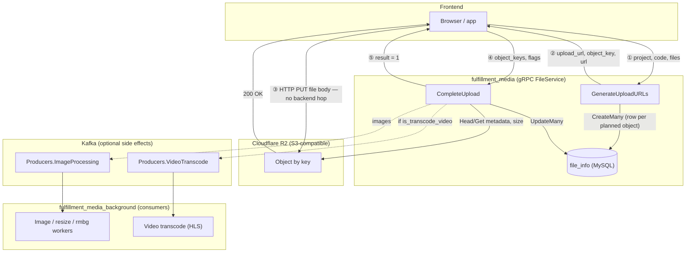

# Presigned upload flow: `GenerateUploadURLs` + direct upload + `CompleteUpload`

This document describes the two-step API pair used for **browser-to-object-storage uploads** without streaming bytes through `fulfillment_media`. The gRPC handlers live in `application/domains/file/delivery/grpc/handler/handler.go`; business logic is in `application/domains/file/usecase/usecase.go`.

Proto definitions: `proto/media/file/file.proto` (`FileService.GenerateUploadURLs`, `FileService.CompleteUpload`).

---

## Diagram style (ASCII vs Mermaid)

| Approach | Pros |
|----------|------|
| **Plain ASCII boxes** | Renders in any viewer (Terminal, Slack snippets); no dependency on a Mermaid renderer. |
| **Mermaid `flowchart` + `subgraph`** (like `flow.md` in other repos) | Same style as other Hasaki flows: systems are grouped (API, Kafka, background workers), async edges are obvious, and GitHub/GitLab/VS Code preview render it natively. |

**This doc uses Mermaid** as the primary diagram so it stays consistent with diagrams that split **message bus**, **background services**, and **gRPC** boundaries.

---

## End-to-end flow (what the frontend does)

**Note:** Step ① creates **metadata rows** before the object exists in R2; if step ③ never succeeds, you can have orphaned `file_info` rows (see below).

1. **Request presigned URLs** — `GenerateUploadURLs` with `project`, `code` (folder), and each file’s `file_name` / optional `content_type`.
2. **Upload each file directly** — HTTP **PUT** the file bytes to `upload_url` returned for that item (S3 `PutObject` presign). Do **not** send the file to `fulfillment_media`.
3. **Confirm completion** — After storage returns success (typically HTTP 200), call `CompleteUpload` with the **`object_key` values** from step 1 (same order as needed only if you batch; keys must match exactly).
4. **Backend work** — The service loads `file_info` by those keys, reads object metadata from R2, persists size (KB), and may enqueue background work (images / video transcode). Response field `result` is `1` on success.

---

## ① `GenerateUploadURLs`

| Item | Detail |
|------|--------|
| **Handler** | `Handler.GenerateUploadURLs` |
| **Usecase** | `usecase.GenerateUploadURLs` |
| **Request** | `GenerateUploadURLsRequest`: `files[]` (`file_name`, `content_type`), `project`, `code` |
| **Response** | `GenerateUploadURLsResponse.res[]`: per file, `upload_url`, `object_key`, `url` |

### Behaviour (summary)

- **Auth**: user id from metadata (`GetUserLoginID`). Invalid/missing user → unauthenticated-style error.
- **Validation**: `project` must exist; `code` must be a folder under that project. Optional check: each `content_type` must match the folder’s allowed `FileExtension` (unless folder allows all types).
- **Object key**: For each non-empty `file_name`, the server builds a **new object name**: `UUID` + truncated original name (length capped), spaces → `-`, then **URL-unescape**-safe handling. This string is the **S3 object key** in the configured R2 bucket (`S3V2` / `constant.R2_CONFIG_NAME`).
- **Presigned URL**: AWS SDK `PutObject` presign with expiry `Media.UploadExpireTime` minutes, or a default (~2 minutes) if unset.
- **Public “link” field `url`**: Built from `FileGateway.URL` template with `project`, `folder`, and the **new** object key — this is the **canonical app URL** for the file after it exists in storage, **not** the presigned upload URL.
- **Database**: **Before returning**, the service calls `file_info` **`CreateMany`** so each planned object has a row (`file_name` = `object_key`, folder/project ids/codes). That way `CompleteUpload` can resolve keys to rows.

### Frontend must retain

- **`object_key`** — Required for `CompleteUpload` (this is what identifies the row and the R2 key).
- **`upload_url`** — Use **once** (or until expiry) for the PUT.
- **`url`** — Use for UI / “share link” patterns that match your gateway/CDN; it does not perform upload.

---

## Direct upload to cloud (②)

| Item | Detail |
|------|--------|
| **Target** | The exact **`upload_url`** string from the response for that file. |
| **Method** | **PUT** (matches S3 `PutObject` presigned request). |
| **Body** | Raw file bytes (`Content-Type` usually matches what you would send; follow your storage/browser requirements). |
| **Backend** | No traffic through `fulfillment_media` for the bytes. |

If PUT fails or the user abandons the flow, you may have **file_info rows without a successful upload** — operational/product decision (cleanup job, retry, etc.).

---

## ③ `CompleteUpload`

| Item | Detail |
|------|--------|
| **Handler** | `Handler.CompleteUpload` |
| **Usecase** | `usecase.CompleteUpload` |
| **Request** | `CompleteUploadRequest`: `object_keys[]`, `is_remove_background`, `is_resize`, `is_transcode_video` (opt-in MP4→HLS; only applies to video-like keys) |
| **Response** | `CompleteUploadResponse`: `result` (`int64`, `1` means success in current implementation) |

### Behaviour (summary)

- **Auth**: same user metadata as above.
- **Validation**: Every `object_key` must exist in `file_info` (loaded by name). Count must match; unknown keys → invalid argument.
- **R2**: For each key, loads **object metadata** (e.g. `ContentLength`) from the bucket; **file must already exist** in R2 or this step fails.
- **Persist**: `UpdateMany` on `file_info` with **size in KB** (from metadata).
- **Side effects** (when configured):
  - **Images** (by extension): Kafka message to image-processing topic with `object_keys`, remove-background and resize flags.
  - **Video**: Only when **`is_transcode_video`** is true (FE opt-in). Eligible extensions (e.g. `.mp4`) receive a Kafka message on the video transcode topic with `source_url` and `video_id` tied to `file_id`.

---

## Notable implementation references

| Concern | Where |
|--------|--------|
| Presigned generation | `usecase.GeneratePresignedURL`, `usecase.GenerateUploadURLs` |
| Models for requests/responses | `application/domains/file/models/mutilpart.go` (`GenerateUploadURLsRequest`, `UploadURL`, `CompleteUploadRequest`) |
| Public URL shape for `UploadURL.Url` | `file/entity` `ExportWithUrl` via `FileGateway.URL` |
| R2 client | `lib.S3Clients[constant.R2_CONFIG_NAME]` |

---

## Operational / integration checklist

- [ ] **Order**: Always call `CompleteUpload` only **after** the storage PUT succeeds (object present in bucket).
- [ ] **Keys**: Use the **`object_key`** from `GenerateUploadURLs`, not the original client file name.
- [ ] **Expiry**: Presigned URLs expire; upload before TTL (see `Media.UploadExpireTime`).
- [ ] **Video (HLS)**: Set **`is_transcode_video`** on `CompleteUpload` when the client wants streaming output; otherwise uploads are not enqueued for transcode. When enabled for video-like keys, the server requires `Service.Kafka.Producers.VideoTranscode` and a resolvable CDN/public URL.
- [ ] **Idempotency**: Re-calling `CompleteUpload` for the same keys may re-publish Kafka / re-run side effects depending on worker design; confirm product expectations.

---

## Related RPCs (not this combo)

Same proto service also exposes streaming upload (`UploadStream`), classic multipart (`CreateUploadMultipart` / `UploadPart` / `CompleteMultipartUpload`), and large-file **presigned multipart** (`CreatePresignedMultipart` / `CompletePresignedMultipart`). Those paths are separate from the **single PUT presigned** flow documented here.
