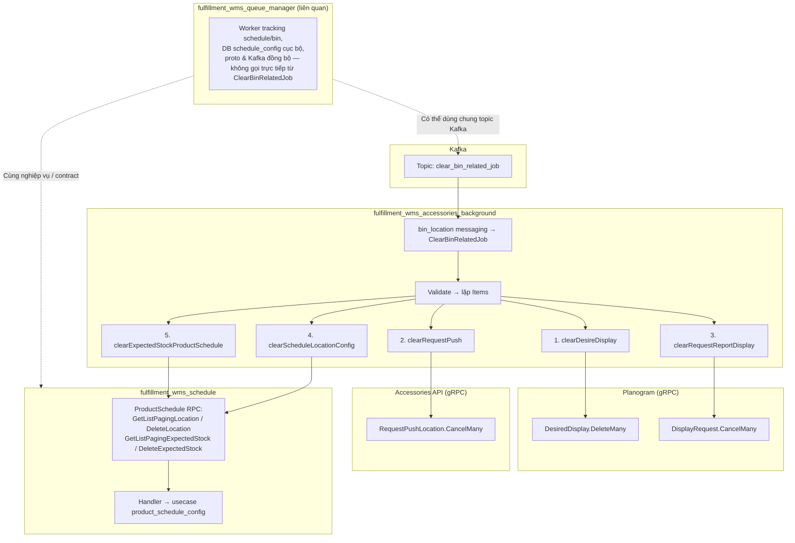

# Job xóa dữ liệu liên quan bin — luồng end-to-end

## Sơ đồ luồng

## Ba repo đóng vai trò gì

| Repository | Vai trò trong luồng này |
|------------|-------------------------|
| **fulfillment_wms_accessories_background** | **Điều phối**: consume Kafka, chạy `ClearBinRelatedJob`, DB nội bộ + gRPC ra Planogram, Accessories API, Schedule. |
| **fulfillment_wms_schedule** | **Backend schedule**: triển khai gRPC `ProductSchedule` (list + xóa cấu hình vị trí và tồn kỳ vọng). |
| **fulfillment_wms_queue_manager** | **Hệ thống lân cận**: tracking và worker quanh schedule/bin (vd. `schedule_config` cục bộ, messaging location schedule). **Không** nằm trên **chuỗi gọi đồng bộ** của `ClearBinRelatedJob`|
