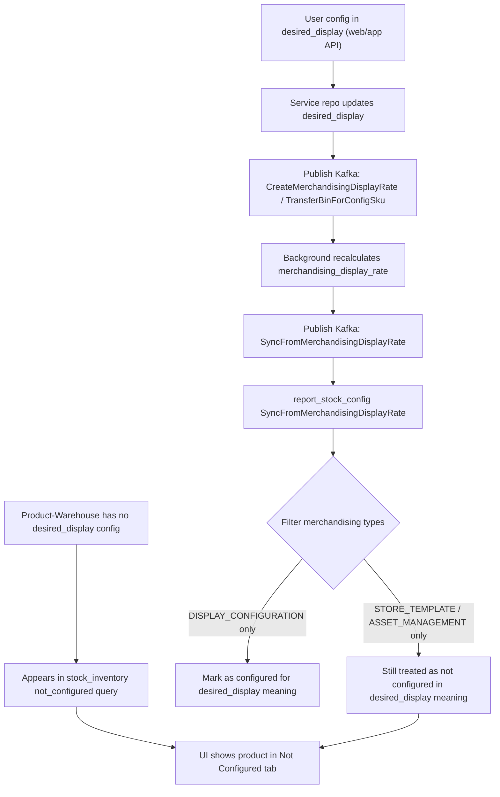

# Display Config: Current Behavior

## Scope

This document records the current behavior for display configuration status across:

- `fulfillment_planogram_be` (service repo)
- `fulfillment_planogram_be_background` (worker/background repo)

It is intentionally descriptive (current-state), not a proposal.

Forward-looking product/engineering spec for template-driven behavior: `template-display-configuration-spec.md`.

## Business Meaning in Current Implementation

The system currently distinguishes two concepts:

- **Configured in desired_display** (user-facing display configuration intent)
- **Configured in merchandising_display_rate** (projection data that can come from multiple types)

As a result, "not configured" in UI/report can still include products that exist in merchandising if that merchandising record is not from desired display type.

## Current Flow

1. If product-warehouse is not configured in desired display, it appears in not-configured flow (`stock_inventory` / report query path).
2. When user configures product via desired_display APIs (web/app), system treats it as no longer not-configured for desired-display meaning and triggers sync to merchandising.
3. Background `report_stock_config` sync from merchandising currently evaluates only records of type:
   - `MERCHANDISING_DISPLAY_RATE_TYPE_DISPLAY_CONFIGURATION`

## Flow Chart

Code reference (background):

- `application/domains/report_stock_config/usecase/usecase.go`
- `SyncFromMerchandisingDisplayRate` filters `Types` to only display configuration.

## Important Consequence

For the same `product_id + warehouse_id`, this is possible and currently valid:

- product exists in `merchandising_display_rate` with type `STORE_TEMPLATE` or `ASSET_MANAGEMENT`
- product is still considered "not configured" for desired display perspective
- product can still appear in not-configured UI/report

So, current "not configured" behavior is effectively aligned to **desired_display configuration state**, not "any merchandising presence".

## Notes for Future Changes

If business wants "configured" to mean any merchandising type, sync/filter logic in background report_stock_config must be adjusted accordingly and verified with UI/report expectations.
