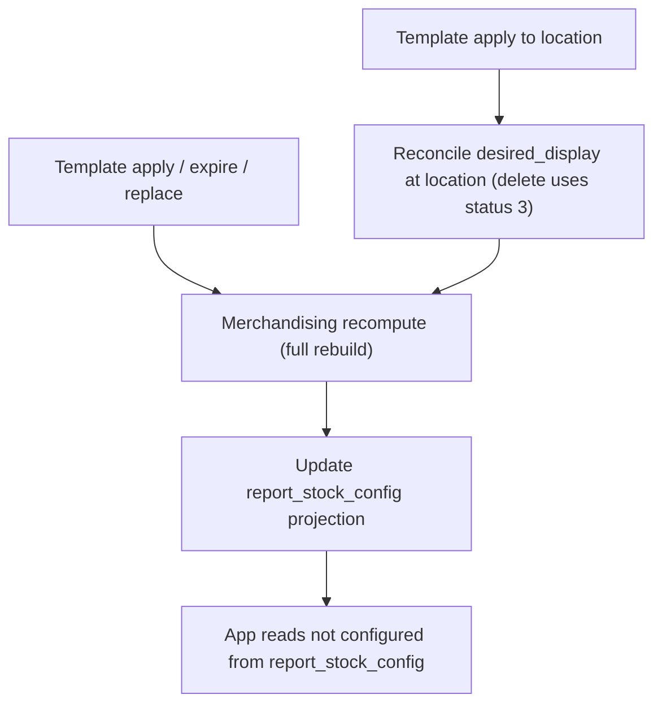

# Spec: Template-driven display configuration (no new DB flag)

## Purpose

Define product behavior when a **store template** is applied to a store location, how it interacts with **desired_display** and **merchandising_display_rate**, and how **report_stock_config** drives the **“not configured”** experience in the app—without introducing a new dedicated “flag” column.

This spec is **forward-looking**. Current behavior is summarized in `display_config.md` / `current_behavior.md`.

## Goals

- When a template covers a SKU at a warehouse, the SKU should **not** appear in flows that prompt **manual desired_display configuration** in the app.
- When template coverage ends and no replacement template covers the SKU, the SKU should **return** to the manual configuration requirement.
- When a template is applied to a location, **existing configuration at that location is cleared**; SKUs are classified into:
  - covered by the applied template (no manual required)
  - not covered (manual required)
- **Desired_display delete** uses **status = 3** (deleted), consistently.

## Non-goals

- Introducing a new persisted “template coverage flag” field solely for this feature.
- Changing unrelated reporting domains beyond what is required to keep a single consistent definition of “needs manual config”.

## Definitions

### Manual configuration requirement (app UX)

A product-warehouse requires **manual desired_display configuration** in the app when it should appear in the **not configured** experience.

**Authoritative signal (target):** derived into `wms_report_stock_config` (`report_stock_config` domain), specifically the configuration bitset used today for “not configured” semantics (see existing constants such as `REPORT_STOCK_CONFIG_CONFIG_NOT_CONFIGURED` in background code).

Naming note for implementers: product language may say “not configured”; in code, ensure comments and function names avoid ambiguous phrases like “set not configured” when the operation actually **clears** the manual requirement.

### Template coverage

A SKU is **template-covered** at a warehouse when an **active** merchandising record of type **store template** applies to that SKU/warehouse (and relevant location scope per business rules).

Implementation detail: today merchandising distinguishes types including:

- `MERCHANDISING_DISPLAY_RATE_TYPE_STORE_TEMPLATE`
- `MERCHANDISING_DISPLAY_RATE_TYPE_DISPLAY_CONFIGURATION`
- `MERCHANDISING_DISPLAY_RATE_TYPE_ASSET_MANAGEMENT`

This spec treats **store template** as the primary “coverage” source for suppressing manual configuration.

### Desired_display lifecycle

- Active/inactive states remain as today for normal operations.
- **Delete** means `status_id = 3` (deleted). Any automation that removes desired_display rows from UX must use this status (not ambiguous “disappear” without a defined status).

## Target end-to-end flow

### 1) Template applied to store / location

1. Template application event occurs (source: template/store-template domain; exact producer is out of scope for this doc).
2. System triggers merchandising recompute for impacted warehouse(s) and location scope (existing pattern: merchandising recompute is not delta-based; it rebuilds projection state).
3. For each impacted `(warehouse_id, product_id)`:
   - If **template-covered**: update `report_stock_config` so the SKU **does not** require manual configuration (clear the manual-not-configured requirement in the config bitset).
   - If **not template-covered** after the apply: ensure `report_stock_config` reflects **manual configuration required**.

### 2) Template expires / removed without replacement

1. Template coverage ends for SKU/warehouse.
2. Merchandising recompute removes or deactivates template-derived rows per existing merchandising rules.
3. `report_stock_config` is updated:
   - If no replacement template coverage exists, SKU returns to **manual configuration required** (appears in not configured UX again).

### 3) Template applied to a specific location (bin/shelf)

Operational rule:

- Applying a template to a location **clears existing desired_display configuration** at that location.
- Classification:
  - SKU is in the applied template set for that location scope → **template-covered** → no manual required.
  - SKU is not in the template set → **manual required**.
- Desired_display rows that are removed by this operation must be represented as **status = 3** (deleted), not left in an ambiguous state.

### 4) App reads “not configured”

Target invariant:

- App surfaces that show “not configured” should read from **`report_stock_config` only**, after the above projection updates, so there is no divergence between modules.

## Differences vs current behavior (must-change list)

Current behavior (summary):

- `report_stock_config.SyncFromMerchandisingDisplayRate` filters merchandising types to **`DISPLAY_CONFIGURATION` only** when syncing “configured/not configured” semantics from merchandising.
- Therefore a SKU can exist in merchandising as **store template** while still appearing as **manual-not-configured** in app flows.

Target behavior changes:

1. **Template merchandising type must participate** in determining whether manual configuration is required (not only `DISPLAY_CONFIGURATION`).
2. **Template apply to location** must explicitly reconcile desired_display rows at that location:
   - remove/replace per rules
   - deletes use **status = 3**
3. **Projection model**: treat `report_stock_config` as the derived “manual work queue” state; merchandising + desired_display are inputs.

## State summary (reference)

This table is normative for engineering discussion (exact bit operations belong in implementation tasks).

| Template-covered (active) | Desired_display (non-deleted meaningful state) | Manual required in app (target) |
|---|---|---|
| yes | ignored for suppression | no |
| no | yes | no |
| no | no | yes |

“Meaningful desired_display state” should be defined precisely in implementation (active vs inactive policy), but delete is always **status = 3**.

## Flow chart

## Acceptance criteria (testable)

- Given an SKU with no desired_display, when template coverage becomes active for that SKU/warehouse, the SKU **does not** appear in the app not-configured list.
- When template coverage ends with no replacement, the SKU **does** appear in the app not-configured list (assuming no other suppression rule applies).
- When template is applied to a location, SKUs not in template set become manual-required; SKUs in template set become not manual-required.
- Any automated removal of desired_display uses **status_id = 3**.

## Implementation notes (engineering)

- This feature crosses **service + background** boundaries: keep Kafka topic contracts and ordering assumptions aligned with existing merchandising recompute → `SyncFromMerchandisingDisplayRate` pipeline.
- Prefer **idempotent recompute** from current DB truth rather than relying on partial deltas, consistent with your stated approach.

## Related docs

- `display_config.md` — current behavior + diagram
- `current_behavior.md` — narrative snapshot (may duplicate; consolidate if desired)
