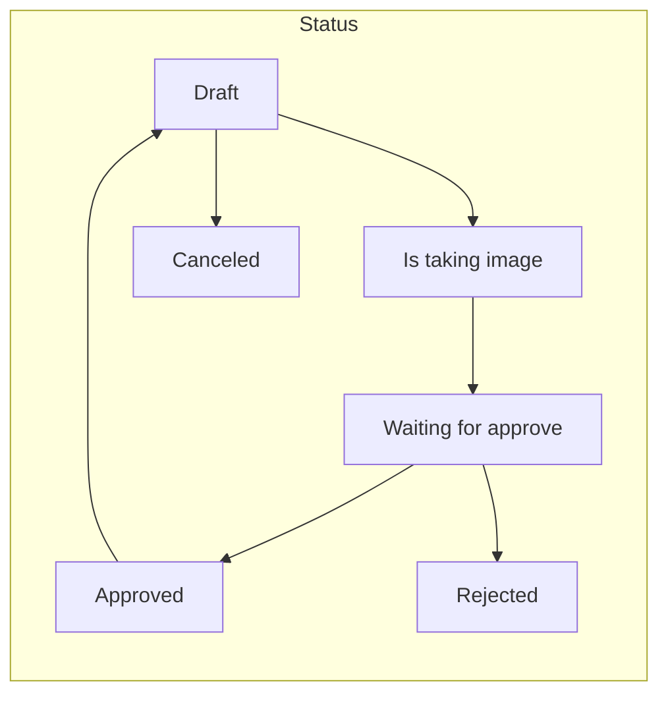
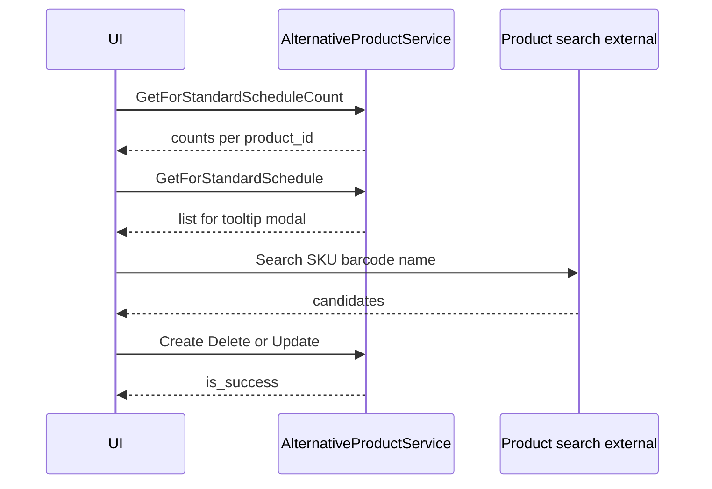
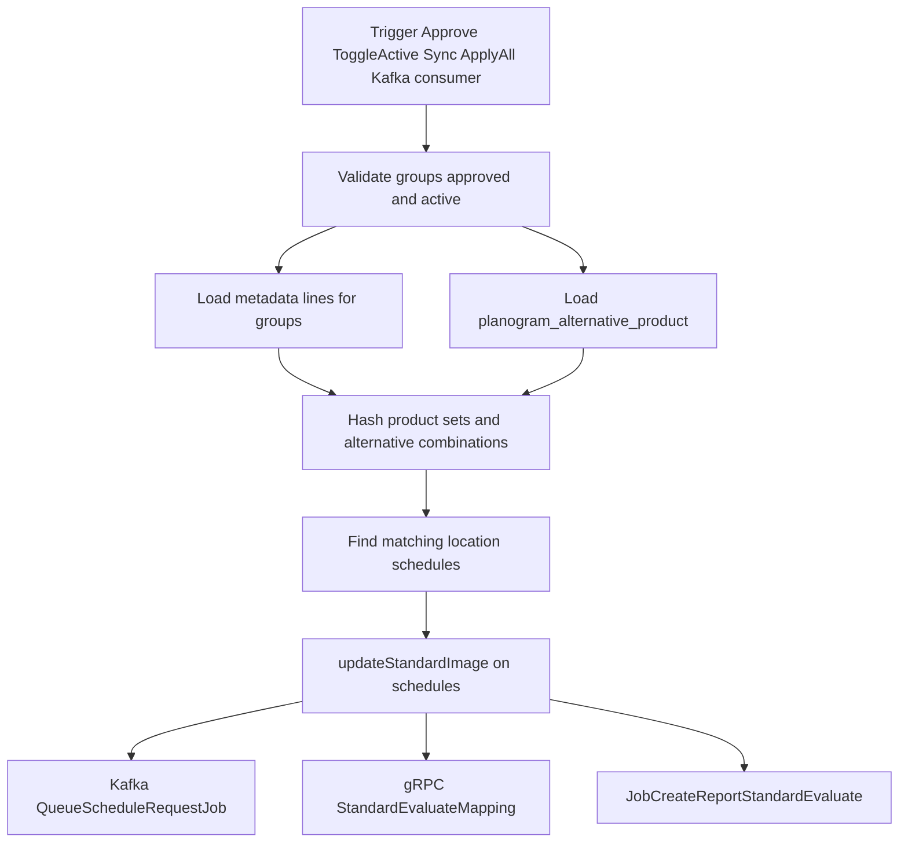
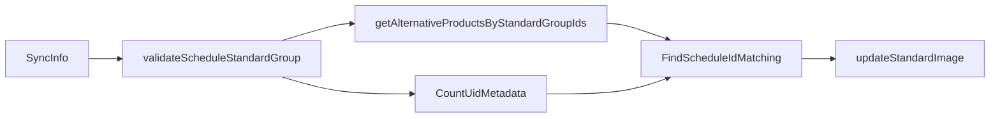

# Standard Group & Alternative Product — Specification

> **Tiếng Việt:** [STANDARD_GROUP_AND_ALTERNATIVE_PRODUCT.vi.md](./STANDARD_GROUP_AND_ALTERNATIVE_PRODUCT.vi.md)

This document maps business requirements, UI screens, APIs, flows, and persistence for **Schedule Standard Group** and **Alternative Product** in `fulfillment_wms_schedule`. Primary code: `application/domains/schedule_standard_group`, `application/domains/alternative_product`. Companion UX reference: extracted images under `.doc/schedule/standard_group/Standard Group/` and `Standard group - alternative product/`.

**Proto sources of truth**

- [proto/schedule/schedule_standard_group/schedule_standard_group.proto](../../../proto/schedule/schedule_standard_group/schedule_standard_group.proto) — `ScheduleStandardGroupService`, base path comment `/api/v1/planogram/schedule-standard-groups`
- [proto/schedule/alternative_product/alternative_product.proto](../../../proto/schedule/alternative_product/alternative_product.proto) — `AlternativeProductService`, base path comment `/api/v1/planogram/alternative-products`

---

## Table of contents

1. [Business requirements](#1-business-requirements)
2. [Screen list & APIs](#2-screen-list--apis)
3. [Business flow](#3-business-flow)
4. [Code flow](#4-code-flow-including-background)
5. [Database flow](#5-database-flow)
6. [Important discrepancies & gaps](#6-important-discrepancies--gaps)

---

## 1. Business requirements

### Why this feature exists

- **Standard groups (planogram):** Operations define a **named standard** as a bundle of SKU lines with quantities, plus **display duration**, **display description**, and **standard images** (master shots). That definition should drive consistency across stores.
- **Reality:** The same physical standard often maps to **multiple valid SKUs** (different brands, packaging, or system duplicates). Display rules are shared; product identities differ.
- **Without alternatives:** A location schedule that stocks an **equivalent** SKU instead of the “canonical” line would **fail** to match the standard group, so it would not receive the correct standard image, duration, or description.
- **Alternative products:** For each **base product line** inside a standard group, planners can attach **equivalent product IDs**. The UI shows a **count badge** on the line, a **tooltip** listing equivalents, and a **modal** to search, add, remove, and save those links.
- **Sync:** When business rules say a group should push to schedules (e.g. approved and active), **matching location schedules** are updated with **standard image**, **duration**, and **display description**. Matching must treat configured **alternatives** as interchangeable with their base line for the purpose of equivalence.
- **Mobile standard capture:** Spec requires **camera-only** capture (no gallery), enabling **complete** only after a photo, then moving the group to **waiting for approve**. That restriction is enforced in the **client**; the server exposes status and image submission via gRPC (see [Standard image / taking picture](#standard-image--taking-picture-mobile--api)).

### Spec vs implementation (matching rule)

- **Master / planogram docs** often describe matching as **100% SKU + quantity** alignment between a standard group and a schedule.
- **This codebase** implements that intent **and** expands it: [`sync_info.go`](../../../application/domains/schedule_standard_group/usecase/sync_info.go) builds hashes for the **original** product mix and **all valid alternative combinations** (`hashGroupedProductsWithAlternatives`, `generateCombinationsRecursive`) so schedules using substituted SKUs can still match.

---

## 2. Screen list & APIs

REST paths below come from **comments on RPCs** in proto; your API gateway may map them differently. All interfaces are **gRPC** with the listed request/response messages.

### Standard group — list, search, import, export

| UI (from spec) | gRPC | Gateway hint (proto comment) | Input (key fields) | Output (key fields) |
|----------------|------|------------------------------|--------------------|---------------------|
| Grid: STT, group name, total SKU, total quantity, duration, status, created/updated, active, actions; filters: group name, SKU/barcode, status, active, created by; **Import** | `GetListPaging` | `GET` base | `GetListPagingRequest`: `page`, `size`, `group_name`, `sku_or_barcodes`, `status_ids`, `is_active`, `created_bies`, `group_codes`, `sort_by`, `order_by`, `config_query` | `GetListPagingResponse`: `records` (`ScheduleStandardGroup`), `count`, `page`, `size` |
| Download export | `Download` | `GET` `/download` | `DownloadRequest`: filters + `export_name`, `max_row_per_file`, `split_mode` | `DownloadResponse`: `url`, `token`, `code`, `by_user_id` |
| Import template | `DownloadTemplate` | `GET` `/download-template` | `DownloadTemplateExcelRequest` (empty) | `DownloadTemplateExcelResponse`: `url` |
| Upload import file | `ImportExcel` | `POST` `/import` (streaming) | Stream of `ImportExcelRequest`: `name`, `file`, `content_type` | `ImportExcelResponse`: `result` |
| Validate import | `ValidateExcel` | `POST` `/validate` (streaming) | Same as import | `ValidateExcelResponse`: `total`, `valid`, `error`, `err_msgs` |

**Business rule (import):** Rows sharing the same **Group name** form one standard group; columns **Group name**, **SKU**, **Quantity** (per spec screenshots).

---

### Standard group — detail

| UI | gRPC | Gateway hint | Input | Output |
|----|------|--------------|-------|--------|
| Header: group name, duration, status, active, audit; display description; product table (SKU, barcode, name, qty, …); standard image slots/thumbnails | `GetDetail` | `GET` `/detail` | `GetDetailRequest`: `id`, optional `page`/`size` for detail lines | `GetDetailResponse`: `record` (`ScheduleStandardGroup` + `standard_image`), `details` (`ScheduleStandardGroupDetail` list + `count`) |
| Edit popup: group name, duration (and full edit: description, images) | `Update` | `PUT` `/edit/:id` | `UpdateRequest`: `id`, `group_name`, `duration`, `display_description`, `standard_image` (`RequestUpdateImage`) | `UpdateResponse`: `result` |
| Active toggle | `ToggleStatus` | `PUT` `/toggle/status/:id` | `ToggleStatusRequest`: `id` | `ToggleStatusResponse`: `record` |
| Remove lines (draft) | `RemoveDetails` | `PUT` `/remove/details` | `RemoveDetailsRequest`: `id`, `detail_ids` | `RemoveDetailsResponse`: `result` |

---

### Standard group — approve, reject, re-open, cancel

| UI | gRPC | Gateway hint | Input | Output |
|----|------|--------------|-------|--------|
| Approve (waiting → approved) | `ApproveStandardGroup` | `PUT` `/approve` | `ApproveStandardGroupRequest`: `ids` | `ApproveStandardGroupResponse`: `result` |
| Reject + reason | `RejectStandardGroup` | `PUT` `/reject` | `RejectStandardGroupRequest`: `ids`, `reason_reject` | `RejectStandardGroupResponse`: `result` |
| Re-open (approved → draft workflow) | `ReOpen` | `PUT` `/re-open` | `ReOpenRequest`: `id` | `ReOpenResponse`: `result` |
| Cancel / delete group | `CancelStandardGroup` | `PUT` `/cancel/:id` | `CancelRequest`: `id` | `CancelResponse`: `result` |

**Side effect:** `ApproveStandardGroup` and **activating** an already **approved** group via `ToggleStatus` publish a Kafka message (`SyncInfoStandardGroup` topic) with `UcSyncInfoRequest` containing affected group ids — see [Code flow](#4-code-flow-including-background).

---

### Standard image / taking picture (mobile & API)

| UI | gRPC | Gateway hint | Input | Output |
|----|------|--------------|-------|--------|
| Claim / start capture session | `ChangeStatusToTakingPicture` | `PUT` `/:id/is-taking-picture` | `ChangeStatusToTakingPictureRequest`: `id` | `ChangeStatusToTakingPictureResponse`: `result` |
| Submit captured images (required slots) | `TakeStandardPicture` | `PUT` `/:id/taking-picture` | `TakeStandardPictureRequest`: `id`, `standard_image` (`RequestTakeStandardPicture`: `image_name`, `image`) | `TakeStandardPictureResponse`: `is_success`, `is_error`, `item` |
| Same as take, after status change helper | `UploadStandardImage` | `PUT` `/:id/upload-image` | Same body as `TakeStandardPictureRequest` | Same as `TakeStandardPictureResponse` |

Server validates **required** `image_name` rows and transitions status toward **waiting for approve** after successful save (see `usecase.TakeStandardPicture`).

---

### Standard group — manual sync & apply all

| UI | gRPC | Gateway hint | Input | Output |
|----|------|--------------|-------|--------|
| Sync selected approved groups to matching schedules | `Sync` | (no path comment on RPC) | `SyncRequest`: `ids` | `SyncResponse`: `result` |
| Apply-all variant | `ApplyAll` | `PUT` `/apply-all` | `ApplyAllRequest`: `ids` | `ApplyAllResponse`: `result` |

Both invoke the same use case: [`SyncInfo`](../../../application/domains/schedule_standard_group/usecase/sync_info.go) from [`handler.go`](../../../application/domains/schedule_standard_group/delivery/grpc/handler/handler.go).

---

### Alternative product — badge, tooltip, modal

**Naming:** Proto uses `standard_schedule_id`; in this product it is the **standard group id** (`wms_schedule_standard_group.id`).

| UI | gRPC | Gateway hint | Input | Output |
|----|------|--------------|-------|--------|
| Badge count per base product line | `GetForStandardScheduleCount` | `GET` `/standard-schedule/count` | `GetForStandardScheduleRequest`: `standard_schedule_id`, `product_id` | `GetForStandardScheduleCountResponse`: `records` (`AlternativeProductForCount`: `product_id`, `quantity`) |
| Tooltip / modal list | `GetForStandardSchedule` | `GET` `/standard-schedule` | Same request | `GetForStandardScheduleResponse`: `records` (`AlternativeProduct`), `count` |
| Add links | `CreateForStandardSchedule` | `POST` `/standard-schedule/create` | `CreateForStandardScheduleRequest`: `standard_schedule_id`, `product_id`, `alternative_product_id` (repeated) | `CreateForStandardScheduleResponse`: `is_success` |
| Remove links | `DeleteForStandardSchedule` | `PUT` `/standard-schedule/delete` | `DeleteForStandardScheduleRequest`: same shape | `DeleteForStandardScheduleResponse`: `is_success` |
| Replace full set | `UpdateForStandardSchedule` | `POST` `/standard-schedule/update` | `UpdateForStandardScheduleRequest`: same shape | `UpdateForStandardScheduleResponse`: `is_success` |

**Product search** (SKU / barcode / product name in the combobox): **not** implemented on `AlternativeProductService` in this repository. The app is expected to call a **separate product catalog / search service** (e.g. Zeus product API); chosen `product_id` values are then sent to the RPCs above.

---

## 3. Business flow

### 3.1 Standard group lifecycle (status)

- **Approve** (from waiting): moves to **Approved** and, for active groups, triggers **async sync** (Kafka) — see code flow.
- **Reject**: moves to **Rejected** with stored reason.
- **Re-open** (from approved): returns group to **draft** workflow per `ReOpen` use case.
- **Toggle active** on an **approved** group: turning **on** publishes the same sync payload as approve path.

### 3.2 Alternative product (UI)

### 3.3 Sync to location schedules

---

## 4. Code flow (including background)

### Layers

| Domain | Entry | Use case | Data |
|--------|--------|----------|------|
| Schedule standard group | [`delivery/grpc/handler/handler.go`](../../../application/domains/schedule_standard_group/delivery/grpc/handler/handler.go) | [`usecase.go`](../../../application/domains/schedule_standard_group/usecase/usecase.go), [`sync_info.go`](../../../application/domains/schedule_standard_group/usecase/sync_info.go) | [`db/schedule_standard_group`](../../../application/domains/db/schedule_standard_group/), [`schedule_metadata`](../../../application/domains/db/schedule/schedule_metadata/), [`location_schedule_config`](../../../application/domains/db/location_schedule_config/) |
| Alternative product | [`alternative_product/delivery/grpc/handler`](../../../application/domains/alternative_product/delivery/grpc/handler/handler.go) | [`alternative_product/usecase`](../../../application/domains/alternative_product/usecase/usecase.go) | [`db/alternative_product`](../../../application/domains/db/alternative_product/) |

### `SyncInfo` pipeline (synchronous when called from `Sync` / `ApplyAll` handler)

1. `SyncInfo` — load standard groups by ids, require **approved**; skip **inactive**.
2. `scheduleMetadataSv.CountUidMetadata` — product lines for groups (`SCHEDULE_METADATA_SOURCE_TYPE_STANDARD_GROUP`).
3. `getAlternativeProductsByStandardGroupIds` — `alternativeProductSv.GetList` with `source_type` = standard schedule (`CONFIG_ALTERNATIVE_PRODUCT_TYPE_STANDARD_SCHEDULE`).
4. `FindScheduleIdMatching` — `GetProductCountsBySchedules`, `groupProductCounts`, `hashGroupedProductsWithAlternatives`, `findMatchingSchedules`.
5. `updateStandardImage` — load location schedules, build `SaveRequest` (standard image JSON, duration, display description), `locScheduleSv.UpdateMany`, optional `locScheduleUc.ReOpenSchedule` for already-approved targets, then:
   - Kafka: `QueueScheduleRequestJob` with `UcCreateAndCancelSchedRequestReq`
   - gRPC: `StandardEvaluateMappingGrpc.GetList` / `Create` for mapping ids
   - `locScheduleSv.JobCreateReportStandardEvaluate`

### Background / async

| Event | Producer | Payload | Consumer in this repo |
|-------|----------|---------|------------------------|
| After **Approve** (active groups) or **Toggle active** (approved → active) | [`usecase.go`](../../../application/domains/schedule_standard_group/usecase/usecase.go) `KafkaPublisher.WriteByKey` | `UcSyncInfoRequest` → topic `config.KafkaTopics.Producers.SyncInfoStandardGroup` ([`config/config.go`](../../../config/config.go)) | **Not present** — assume an external worker calls the same `SyncInfo` logic or the `Sync` RPC |

### `SyncInfo` internal (compact)

---

## 5. Database flow

### Tables

| Table | Entity | Role |
|-------|--------|------|
| `wms_schedule_standard_group` | [`db/schedule_standard_group/entity`](../../../application/domains/db/schedule_standard_group/entity/schedule_standard_group.go) | Master row: `group_code`, `group_name`, `status_id`, `is_active`, `duration`, `display_description`, `standard_image` (JSON string), `reason_reject`, audit fields |
| `wms_schedule_metadata` | [`db/schedule/schedule_metadata/entity`](../../../application/domains/db/schedule/schedule_metadata/entity/schedule_metadata.go) | Lines for a “schedule”; for standard groups, `schedule_id` references the **standard group id** and `metadata_source_type` = **`STANDARD_GROUP`** (`SCHEDULE_METADATA_SOURCE_TYPE_STANDARD_GROUP`) |
| `planogram_alternative_product` | [`db/alternative_product/entity`](../../../application/domains/db/alternative_product/entity/alternative_product.go) | `source_id` = standard group id, `source_type` = standard schedule type; `product_id` = base line; `alternative_product_id` + denormalized SKU/barcode/name fields |
| `wms_schedule_config` | [`db/schedule/schedule_config/entity`](../../../application/domains/db/schedule/schedule_config/entity/schedule_config.go) | **Location schedules** updated during sync (`standard_image`, duration, display description via location schedule save model) |

### Read/write by feature

| Feature | Read | Write |
|---------|------|-------|
| List / detail standard group | `wms_schedule_standard_group`, joins for totals; detail lines from `wms_schedule_metadata` | — |
| Edit / toggle / approve / reject / re-open / cancel | Above | `wms_schedule_standard_group` |
| Import | Template N/A | Creates/updates group + metadata rows (import use case) |
| Alternative modal | `planogram_alternative_product` (+ product joins in queries) | `planogram_alternative_product` |
| Sync | `wms_schedule_standard_group`, `wms_schedule_metadata`, `planogram_alternative_product`, schedule product aggregates | `wms_schedule_config` (and related via `locScheduleSv`), plus side-effect jobs |

---

## 6. Important discrepancies & gaps

1. **Product search** for the alternative-product modal is **out of scope** of `AlternativeProductService`; integrate a **catalog API** separately.
2. **Kafka topic `SyncInfoStandardGroup`**: **produced** in-repo; **no consumer** found in this repository — document operational responsibility (worker / bridge) explicitly in runbooks.
3. **Master doc “100% SKU + qty”** vs **code**: implementation **adds alternative combinations** for matching; QA should test substitution scenarios against [`sync_info.go`](../../../application/domains/schedule_standard_group/usecase/sync_info.go).
4. **Proto field name** `standard_schedule_id` means **standard group id** in this bounded context — keep naming aligned in client apps to avoid confusion.

---

*Generated to align with repository state; re-run `npx gitnexus analyze` after large code changes if you rely on GitNexus indexing.*
