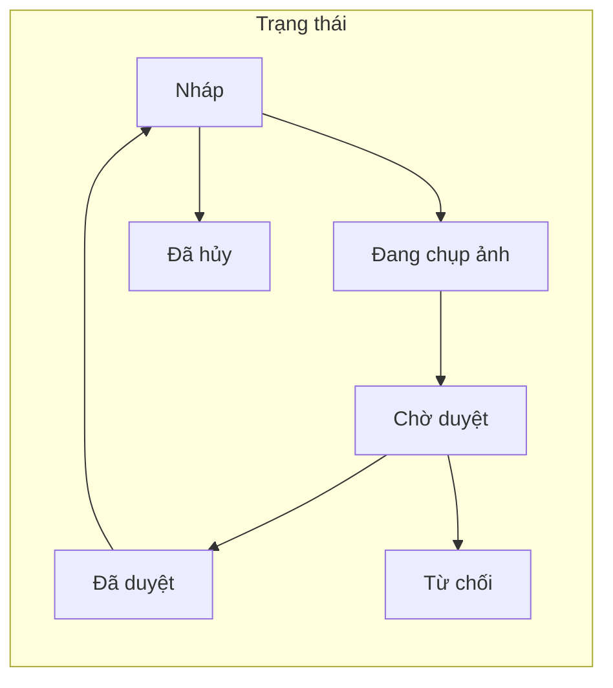
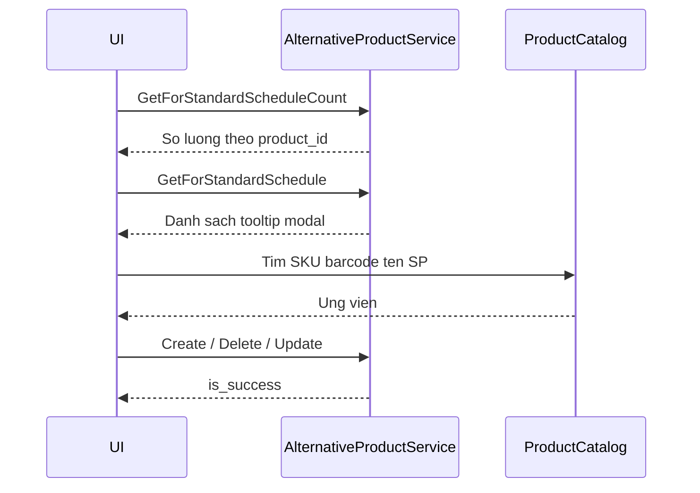
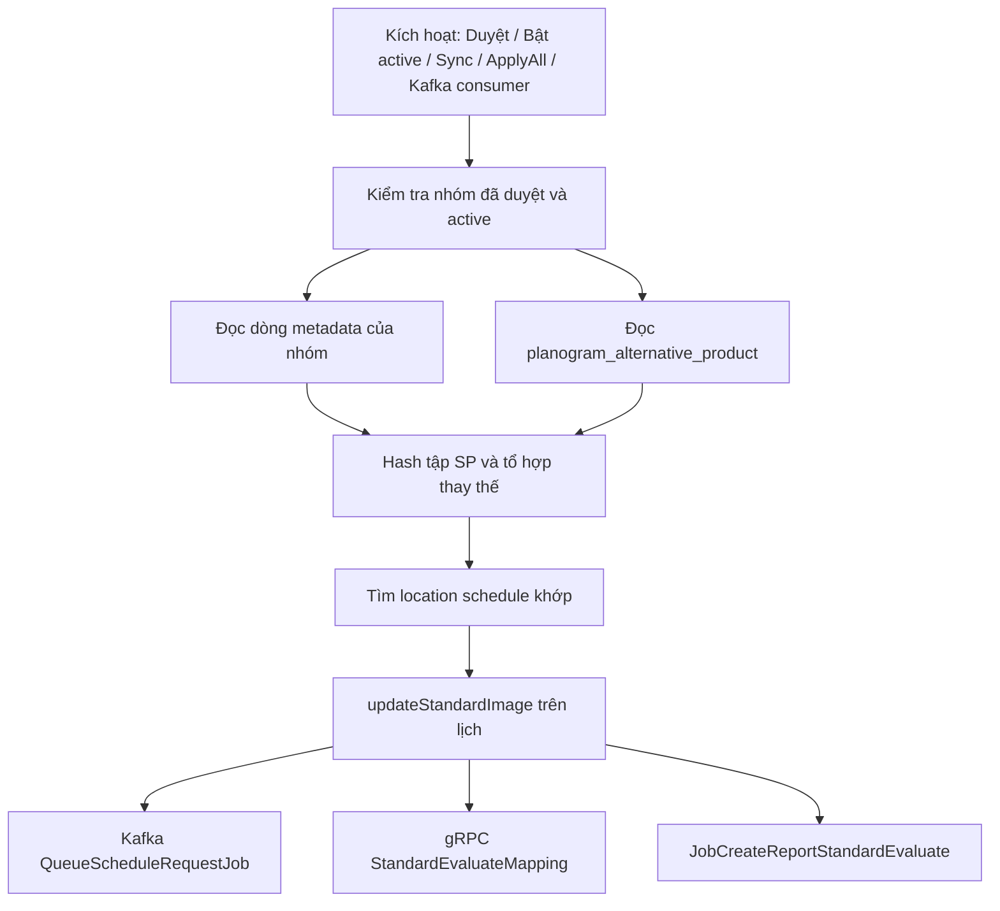
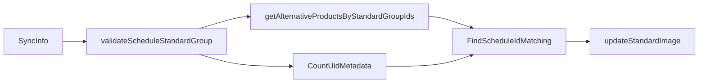

# Standard Group & Alternative Product — Đặc tả

> **English:** [STANDARD_GROUP_AND_ALTERNATIVE_PRODUCT.md](./STANDARD_GROUP_AND_ALTERNATIVE_PRODUCT.md)

Tài liệu này ánh xạ yêu cầu nghiệp vụ, màn hình UI, API, luồng xử lý và lưu trữ cho **Schedule Standard Group** (nhóm tiêu chuẩn lịch) và **Alternative Product** (sản phẩm tương đương) trong `fulfillment_wms_schedule`. Mã nguồn chính: `application/domains/schedule_standard_group`, `application/domains/alternative_product`. Tham chiếu UX: ảnh trích từ PDF tại `.doc/schedule/standard_group/Standard Group/` và `Standard group - alternative product/`.

**Proto chuẩn**

- [proto/schedule/schedule_standard_group/schedule_standard_group.proto](../../../fulfillment_wms_schedule/proto/schedule/schedule_standard_group/schedule_standard_group.proto) — `ScheduleStandardGroupService`, ghi chú base path `/api/v1/planogram/schedule-standard-groups`
- [proto/schedule/alternative_product/alternative_product.proto](../../../fulfillment_wms_schedule/proto/schedule/alternative_product/alternative_product.proto) — `AlternativeProductService`, ghi chú base path `/api/v1/planogram/alternative-products`

---

## Mục lục

1. [Yêu cầu nghiệp vụ](#1-yêu-cầu-nghiệp-vụ)
2. [Danh sách màn hình & API](#2-danh-sách-màn-hình--api)
3. [Luồng nghiệp vụ](#3-luồng-nghiệp-vụ)
4. [Luồng code](#4-luồng-code-kể-cả-nền)
5. [Luồng cơ sở dữ liệu](#5-luồng-cơ-sở-dữ-liệu)
6. [Lệch spec & khoảng trống](#6-lệch-spec--khoảng-trống)

---

## 1. Yêu cầu nghiệp vụ

### Vì sao cần tính năng

- **Nhóm tiêu chuẩn (planogram):** Vận hành định nghĩa **một chuẩn có tên** gồm các dòng SKU kèm số lượng, cộng **thời gian thực hiện**, **mô tả trưng bày**, và **hình ảnh tiêu chuẩn** (ảnh master). Định nghĩa này dùng để thống nhất cách trưng bày giữa các cửa hàng.
- **Thực tế:** Cùng một chuẩn vật lý thường ứng với **nhiều SKU hợp lệ** (khác thương hiệu, bao bì, hoặc trùng trên hệ thống). Quy tắc trưng bày giống nhau; danh tính sản phẩm khác nhau.
- **Không có SP thay thế:** Một location schedule nếu lưu **SKU tương đương** thay cho dòng “chuẩn” sẽ **không khớp** nhóm tiêu chuẩn, nên không nhận đúng hình tiêu chuẩn, duration, mô tả.
- **Sản phẩm thay thế:** Với **mỗi dòng sản phẩm gốc** trong nhóm tiêu chuẩn, người lập kế hoạch gắn **các product_id tương đương**. UI hiển thị **badge số lượng** trên dòng, **tooltip** liệt kê SP tương tự, và **modal** để tìm, thêm, xóa, lưu các liên kết.
- **Đồng bộ (sync):** Khi luật nghiệp vụ cho phép đẩy xuống **schedule** (ví dụ đã duyệt và đang active), các **location schedule khớp** được cập nhật **standard image**, **duration**, **display description**. Khớp phải coi **SP thay thế** có thể thay thế dòng gốc khi so sánh tương đương.
- **Chụp ảnh tiêu chuẩn (mobile):** Spec yêu cầu chỉ **chụp trực tiếp** (không chọn ảnh từ thư viện), chỉ **hoàn tất** sau khi có ảnh, rồi chuyển nhóm sang **chờ duyệt**. Ràng buộc này thực hiện ở **client**; server cung cấp chuyển trạng thái và nhận ảnh qua gRPC (xem mục **Hình ảnh tiêu chuẩn / chụp ảnh** trong [§2](#2-danh-sách-màn-hình--api)).

### Spec so với code (luật khớp)

- Tài liệu **Master / planogram** thường mô tả khớp là **100% SKU + số lượng** giữa nhóm tiêu chuẩn và lịch.
- **Codebase này** thực hiện đúng ý đó **và mở rộng**: [`sync_info.go`](../../../fulfillment_wms_schedule/application/domains/schedule_standard_group/usecase/sync_info.go) tạo hash cho **tổ hợp sản phẩm gốc** và **mọi tổ hợp thay thế hợp lệ** (`hashGroupedProductsWithAlternatives`, `generateCombinationsRecursive`) để lịch dùng SKU thay thế vẫn có thể khớp.

---

## 2. Danh sách màn hình & API

Đường dẫn REST dưới đây lấy từ **ghi chú trên RPC** trong proto; API gateway của bạn có thể map khác. Tất cả là **gRPC** với message request/response đã liệt kê.

### Nhóm tiêu chuẩn — danh sách, tìm kiếm, import, export

| UI (theo spec) | gRPC | Gợi ý gateway (comment proto) | Đầu vào (trường chính) | Đầu ra (trường chính) |
|----------------|------|-------------------------------|-------------------------|------------------------|
| Lưới: STT, tên nhóm, tổng SKU, tổng SL, duration, trạng thái, tạo/cập nhật, active, thao tác; bộ lọc: tên nhóm, SKU/mã vạch, trạng thái, active, người tạo; **Import** | `GetListPaging` | `GET` base | `GetListPagingRequest`: `page`, `size`, `group_name`, `sku_or_barcodes`, `status_ids`, `is_active`, `created_bies`, `group_codes`, `sort_by`, `order_by`, `config_query` | `GetListPagingResponse`: `records` (`ScheduleStandardGroup`), `count`, `page`, `size` |
| Tải export | `Download` | `GET` `/download` | `DownloadRequest`: bộ lọc + `export_name`, `max_row_per_file`, `split_mode` | `DownloadResponse`: `url`, `token`, `code`, `by_user_id` |
| File mẫu import | `DownloadTemplate` | `GET` `/download-template` | `DownloadTemplateExcelRequest` (rỗng) | `DownloadTemplateExcelResponse`: `url` |
| Upload file import | `ImportExcel` | `POST` `/import` (streaming) | Stream `ImportExcelRequest`: `name`, `file`, `content_type` | `ImportExcelResponse`: `result` |
| Kiểm tra import | `ValidateExcel` | `POST` `/validate` (streaming) | Giống import | `ValidateExcelResponse`: `total`, `valid`, `error`, `err_msgs` |

**Luật nghiệp vụ (import):** Các dòng cùng **Group name** tạo một nhóm tiêu chuẩn; cột **Group name**, **SKU**, **Quantity** (theo màn hình spec).

---

### Nhóm tiêu chuẩn — chi tiết

| UI | gRPC | Gateway | Đầu vào | Đầu ra |
|----|------|---------|---------|--------|
| Header: tên nhóm, duration, trạng thái, active, audit; mô tả trưng bày; bảng SP (SKU, barcode, tên, SL…); slot/thumbnail hình tiêu chuẩn | `GetDetail` | `GET` `/detail` | `GetDetailRequest`: `id`, tùy chọn `page`/`size` cho dòng chi tiết | `GetDetailResponse`: `record` (`ScheduleStandardGroup` + `standard_image`), `details` (danh sách `ScheduleStandardGroupDetail` + `count`) |
| Popup chỉnh sửa: tên nhóm, duration (và chỉnh đủ: mô tả, ảnh) | `Update` | `PUT` `/edit/:id` | `UpdateRequest`: `id`, `group_name`, `duration`, `display_description`, `standard_image` (`RequestUpdateImage`) | `UpdateResponse`: `result` |
| Bật/tắt active | `ToggleStatus` | `PUT` `/toggle/status/:id` | `ToggleStatusRequest`: `id` | `ToggleStatusResponse`: `record` |
| Xóa dòng (draft) | `RemoveDetails` | `PUT` `/remove/details` | `RemoveDetailsRequest`: `id`, `detail_ids` | `RemoveDetailsResponse`: `result` |

---

### Nhóm tiêu chuẩn — duyệt, từ chối, xử lý lại, hủy

| UI | gRPC | Gateway | Đầu vào | Đầu ra |
|----|------|---------|---------|--------|
| Duyệt (chờ duyệt → đã duyệt) | `ApproveStandardGroup` | `PUT` `/approve` | `ApproveStandardGroupRequest`: `ids` | `ApproveStandardGroupResponse`: `result` |
| Từ chối + lý do | `RejectStandardGroup` | `PUT` `/reject` | `RejectStandardGroupRequest`: `ids`, `reason_reject` | `RejectStandardGroupResponse`: `result` |
| Xử lý lại (đã duyệt → luồng nháp) | `ReOpen` | `PUT` `/re-open` | `ReOpenRequest`: `id` | `ReOpenResponse`: `result` |
| Hủy / xóa nhóm | `CancelStandardGroup` | `PUT` `/cancel/:id` | `CancelRequest`: `id` | `CancelResponse`: `result` |

**Tác dụng phụ:** `ApproveStandardGroup` và **bật active** nhóm **đã duyệt** qua `ToggleStatus` sẽ publish message Kafka (topic `SyncInfoStandardGroup`) chứa `UcSyncInfoRequest` với danh sách id nhóm — xem [Luồng code](#4-luồng-code-kể-cả-nền).

---

### Hình ảnh tiêu chuẩn / chụp ảnh (mobile & API)

| UI | gRPC | Gateway | Đầu vào | Đầu ra |
|----|------|---------|---------|--------|
| Bắt đầu phiên chụp | `ChangeStatusToTakingPicture` | `PUT` `/:id/is-taking-picture` | `ChangeStatusToTakingPictureRequest`: `id` | `ChangeStatusToTakingPictureResponse`: `result` |
| Gửi ảnh đã chụp (slot bắt buộc) | `TakeStandardPicture` | `PUT` `/:id/taking-picture` | `TakeStandardPictureRequest`: `id`, `standard_image` (`RequestTakeStandardPicture`: `image_name`, `image`) | `TakeStandardPictureResponse`: `is_success`, `is_error`, `item` |
| Giống take, helper sau đổi trạng thái | `UploadStandardImage` | `PUT` `/:id/upload-image` | Cùng body `TakeStandardPictureRequest` | Giống `TakeStandardPictureResponse` |

Server kiểm tra các `image_name` **bắt buộc** và chuyển trạng thái về **chờ duyệt** sau khi lưu thành công (xem `usecase.TakeStandardPicture`).

---

### Nhóm tiêu chuẩn — đồng bộ thủ công & apply all

| UI | gRPC | Gateway | Đầu vào | Đầu ra |
|----|------|---------|---------|--------|
| Đồng bộ các nhóm đã duyệt đã chọn xuống lịch khớp | `Sync` | (RPC không có comment path) | `SyncRequest`: `ids` | `SyncResponse`: `result` |
| Biến thể apply-all | `ApplyAll` | `PUT` `/apply-all` | `ApplyAllRequest`: `ids` | `ApplyAllResponse`: `result` |

Cả hai gọi cùng use case [`SyncInfo`](../../../fulfillment_wms_schedule/application/domains/schedule_standard_group/usecase/sync_info.go) từ [`handler.go`](../../../fulfillment_wms_schedule/application/domains/schedule_standard_group/delivery/grpc/handler/handler.go).

---

### Sản phẩm thay thế — badge, tooltip, modal

**Đặt tên:** Proto dùng `standard_schedule_id`; trong sản phẩm này là **id nhóm tiêu chuẩn** (`wms_schedule_standard_group.id`).

| UI | gRPC | Gateway | Đầu vào | Đầu ra |
|----|------|---------|---------|--------|
| Badge đếm theo dòng SP gốc | `GetForStandardScheduleCount` | `GET` `/standard-schedule/count` | `GetForStandardScheduleRequest`: `standard_schedule_id`, `product_id` | `GetForStandardScheduleCountResponse`: `records` (`AlternativeProductForCount`: `product_id`, `quantity`) |
| Tooltip / danh sách modal | `GetForStandardSchedule` | `GET` `/standard-schedule` | Cùng request | `GetForStandardScheduleResponse`: `records` (`AlternativeProduct`), `count` |
| Thêm liên kết | `CreateForStandardSchedule` | `POST` `/standard-schedule/create` | `CreateForStandardScheduleRequest`: `standard_schedule_id`, `product_id`, `alternative_product_id` (lặp) | `CreateForStandardScheduleResponse`: `is_success` |
| Xóa liên kết | `DeleteForStandardSchedule` | `PUT` `/standard-schedule/delete` | `DeleteForStandardScheduleRequest`: cùng cấu trúc | `DeleteForStandardScheduleResponse`: `is_success` |
| Thay toàn bộ tập | `UpdateForStandardSchedule` | `POST` `/standard-schedule/update` | `UpdateForStandardScheduleRequest`: cùng cấu trúc | `UpdateForStandardScheduleResponse`: `is_success` |

**Tìm sản phẩm** (SKU / barcode / tên trong combobox): **không** triển khai trong `AlternativeProductService` của repo này. Ứng dụng cần gọi **dịch vụ catalog / tìm kiếm sản phẩm riêng** (ví dụ Zeus product API); sau đó gửi `product_id` đã chọn lên các RPC trên.

---

## 3. Luồng nghiệp vụ

### 3.1 Vòng đời nhóm tiêu chuẩn (trạng thái)

- **Duyệt** (từ chờ duyệt): chuyển **Đã duyệt**; với nhóm **active** thì kích hoạt **đồng bộ bất đồng bộ** (Kafka) — xem luồng code.
- **Từ chối:** chuyển **Đã từ chối** và lưu lý do.
- **Xử lý lại** (từ đã duyệt): đưa nhóm về luồng nháp theo use case `ReOpen`.
- **Toggle active** trên nhóm **đã duyệt:** bật **on** publish cùng payload sync như nhánh duyệt.

### 3.2 Sản phẩm thay thế (UI)

### 3.3 Đồng bộ xuống location schedule

---

## 4. Luồng code (kể cả background)

### Tầng

| Domain | Điểm vào | Use case | Dữ liệu |
|--------|----------|----------|---------|
| Schedule standard group | [`delivery/grpc/handler/handler.go`](../../../fulfillment_wms_schedule/application/domains/schedule_standard_group/delivery/grpc/handler/handler.go) | [`usecase.go`](../../../fulfillment_wms_schedule/application/domains/schedule_standard_group/usecase/usecase.go), [`sync_info.go`](../../../fulfillment_wms_schedule/application/domains/schedule_standard_group/usecase/sync_info.go) | [`db/schedule_standard_group`](../../../fulfillment_wms_schedule/application/domains/db/schedule_standard_group/), [`schedule_metadata`](../../../fulfillment_wms_schedule/application/domains/db/schedule/schedule_metadata/), [`location_schedule_config`](../../../fulfillment_wms_schedule/application/domains/db/location_schedule_config/) |
| Alternative product | [`alternative_product/delivery/grpc/handler`](../../../fulfillment_wms_schedule/application/domains/alternative_product/delivery/grpc/handler/handler.go) | [`alternative_product/usecase`](../../../fulfillment_wms_schedule/application/domains/alternative_product/usecase/usecase.go) | [`db/alternative_product`](../../../fulfillment_wms_schedule/application/domains/db/alternative_product/) |

### Pipeline `SyncInfo` (đồng bộ khi gọi từ handler `Sync` / `ApplyAll`)

1. `SyncInfo` — load nhóm theo id, bắt buộc **đã duyệt**; bỏ qua **inactive**.
2. `scheduleMetadataSv.CountUidMetadata` — dòng sản phẩm của nhóm (`SCHEDULE_METADATA_SOURCE_TYPE_STANDARD_GROUP`).
3. `getAlternativeProductsByStandardGroupIds` — `alternativeProductSv.GetList` với `source_type` = standard schedule (`CONFIG_ALTERNATIVE_PRODUCT_TYPE_STANDARD_SCHEDULE`).
4. `FindScheduleIdMatching` — `GetProductCountsBySchedules`, `groupProductCounts`, `hashGroupedProductsWithAlternatives`, `findMatchingSchedules`.
5. `updateStandardImage` — load location schedule, tạo `SaveRequest` (JSON standard image, duration, display description), `locScheduleSv.UpdateMany`, tùy chọn `locScheduleUc.ReOpenSchedule` cho lịch đích đã approved, sau đó:
   - Kafka: `QueueScheduleRequestJob` với `UcCreateAndCancelSchedRequestReq`
   - gRPC: `StandardEvaluateMappingGrpc.GetList` / `Create` cho mapping
   - `locScheduleSv.JobCreateReportStandardEvaluate`

### Nền / bất đồng bộ

| Sự kiện | Producer | Payload | Consumer trong repo này |
|---------|----------|---------|-------------------------|
| Sau **Duyệt** (nhóm active) hoặc **Toggle active** (đã duyệt → active) | [`usecase.go`](../../../fulfillment_wms_schedule/application/domains/schedule_standard_group/usecase/usecase.go) `KafkaPublisher.WriteByKey` | `UcSyncInfoRequest` → topic `config.KafkaTopics.Producers.SyncInfoStandardGroup` ([`config/config.go`](../../../fulfillment_wms_schedule/config/config.go)) | **Không có** — giả định worker ngoài gọi cùng logic `SyncInfo` hoặc RPC `Sync` |

### Bên trong `SyncInfo` (rút gọn)

---

## 5. Luồng cơ sở dữ liệu

### Bảng

| Bảng | Entity | Vai trò |
|------|--------|---------|
| `wms_schedule_standard_group` | [`db/schedule_standard_group/entity`](../../../fulfillment_wms_schedule/application/domains/db/schedule_standard_group/entity/schedule_standard_group.go) | Bản ghi master: `group_code`, `group_name`, `status_id`, `is_active`, `duration`, `display_description`, `standard_image` (chuỗi JSON), `reason_reject`, audit |
| `wms_schedule_metadata` | [`db/schedule/schedule_metadata/entity`](../../../fulfillment_wms_schedule/application/domains/db/schedule/schedule_metadata/entity/schedule_metadata.go) | Dòng của một “schedule”; với nhóm tiêu chuẩn, `schedule_id` trỏ **id nhóm tiêu chuẩn** và `metadata_source_type` = **`STANDARD_GROUP`** (`SCHEDULE_METADATA_SOURCE_TYPE_STANDARD_GROUP`) |
| `planogram_alternative_product` | [`db/alternative_product/entity`](../../../fulfillment_wms_schedule/application/domains/db/alternative_product/entity/alternative_product.go) | `source_id` = id nhóm tiêu chuẩn, `source_type` = loại standard schedule; `product_id` = dòng gốc; `alternative_product_id` + trường SKU/barcode/name denormalized |
| `wms_schedule_config` | [`db/schedule/schedule_config/entity`](../../../fulfillment_wms_schedule/application/domains/db/schedule/schedule_config/entity/schedule_config.go) | **Location schedule** được cập nhật khi sync (`standard_image`, duration, display description qua model save của location schedule) |

### Đọc/ghi theo tính năng

| Tính năng | Đọc | Ghi |
|-----------|-----|-----|
| Danh sách / chi tiết nhóm tiêu chuẩn | `wms_schedule_standard_group`, join tổng; dòng chi tiết từ `wms_schedule_metadata` | — |
| Sửa / toggle / duyệt / từ chối / xử lý lại / hủy | Như trên | `wms_schedule_standard_group` |
| Import | Template không đọc DB | Tạo/cập nhật nhóm + dòng metadata (import use case) |
| Modal thay thế | `planogram_alternative_product` (+ join sản phẩm trong query) | `planogram_alternative_product` |
| Sync | `wms_schedule_standard_group`, `wms_schedule_metadata`, `planogram_alternative_product`, tổng hợp SP trên lịch | `wms_schedule_config` (và liên quan qua `locScheduleSv`), cộng job phụ |

---

## 6. Lệch spec & khoảng trống

1. **Tìm sản phẩm** cho modal thay thể **không thuộc** `AlternativeProductService`; tích hợp **API catalog** riêng.
2. **Kafka topic `SyncInfoStandardGroup`:** **có producer** trong repo; **không thấy consumer** trong repo — consumer nằm trong queue_manager, trong đó gọi về hàm `SyncInfo` trong repo này.
3. **Tài liệu Master “100% SKU + SL”** so với **code**: code **bổ sung tổ hợp thay thế** khi khớp; QA nên kiểm kịch bản thay SKU với [`sync_info.go`](../../../fulfillment_wms_schedule/application/domains/schedule_standard_group/usecase/sync_info.go).
4. **Tên field proto** `standard_schedule_id` trong bounded context này là **id nhóm tiêu chuẩn** — client nên thống nhất naming để tránh nhầm.

---

*Tài liệu khớp trạng thái repo; sau thay đổi lớn có thể chạy `npx gitnexus analyze` nếu dùng GitNexus.*
